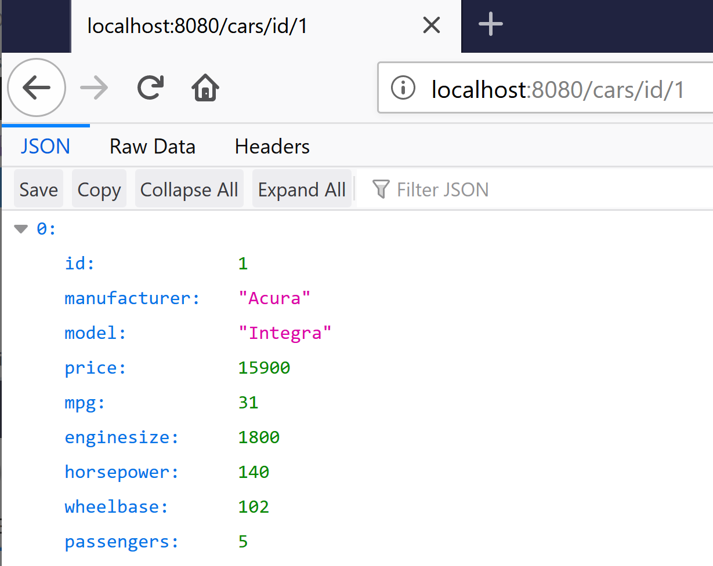

# Cars93APIEndpoint

This is a simple API Endpoint server written in Go for the [Cars93 database](https://www.rdocumentation.org/packages/MASS/versions/7.3-51.4/topics/Cars93). The code is based on the article [Making a RESTful JSON API in Go](http://thenewstack.io/make-a-restful-json-api-go/) by Cory LaNou and extended to manage the Cars93 data using an SQLite database.

## Prerequisites

This application requires the following components:

* Go tools [https://golang.org/doc/install](https://golang.org/doc/install)
* Gorilla request router and dispatcher for Go [https://www.gorillatoolkit.org/pkg/mux](https://www.gorillatoolkit.org/pkg/mux)
* SQLite3 SQL database engine driver for Go [https://github.com/mattn/go-sqlite3](https://github.com/mattn/go-sqlite3)
* SQLite3 SQL database engine [https://www.sqlite.org/index.html](https://www.sqlite.org/index.html)

## Installing on Ubuntu and Windows WSL

1. Install the `Go` tools

    ```
    $ sudo apt update
    $ sudo apt install golang-go
    ```

2. Install SQLite3

    ```
    $ sudo apt install sqlite3 libsqlite3-dev
    ```

3. Install the Gorilla router and SQLite3 driver

    ```
    $ go get github.com/gorilla/mux
    $ go get github.com/mattn/go-sqlite3
    ```    

## Installing on MacOS

1. Install the `Go` tools

    ```
    $ brew install go
    ```

2. Install SQLite3

    ```
    $ brew install sqlite3
    ```

3. Install the Gorilla router and SQLite3 driver

    ```
    $ go get github.com/gorilla/mux
    $ go get github.com/mattn/go-sqlite3
    ```    

## Creating the Database

The repository contains a CSV file, which captures the data for the 93 cars. Use the `makecarsdb` script to create the cars93.db SQLite database file for the restful_sql program as follows:


```
$ ./makecarsdb 
Wrote cars93.db
$ echo "select count(*) from Cars" | sqlite3 cars93.db 
93
```

## Building and Testing the Server

Build the restful_sql executable with the `go build` command as follows:

```
$ go build restful_sql.go handlers.go logger.go repo.go router.go routes.go
```

Enter `./restful_sql` to run the executable. The program starts and listens for requests.

```
$ ./restful_sql
Running on port :8080 ...
  Try http://localhost:8080/cars
      http://localhost:8080/cars/1
```

In a browser window, navigate to `http://localhost:8080/cars/1` to test the API.



Alternatively, use the `curl` command on the command line to retrieve the data.

```
$ curl http://localhost:8080/cars/id/1
[{"id":1,"manufacturer":"Acura","model":"Integra","price":15900,"mpg":31,
  "enginesize":1800,"horsepower":140,"wheelbase":102,"passengers":5}]
```

Note that restful_sql logs these connections to the server in the window where you started the program.

```
2020/01/07 16:49:44 GET /cars/id/1  getCarsByID  1.5128ms
2020/01/07 16:49:52 GET /cars/id/1  getCarsByID  1.2665ms
```

# API Endpoints

restful_sql implements the following API endpoints:

http://localhost:8080/cars/allcars				 : Return all cars in the database

http://localhost:8080/cars/id/{id}				 : Return car with id = {id}

http://localhost:8080/cars/allmanufacturers		 : Return all car manufacturers

http://localhost:8080/cars/manufacturer/{mfgr}	 : Return all cars manufactured by {mfgr}

http://localhost:8080/cars/maxprice/{price}		 : Return all cars with a price less than or equal to {price}

http://localhost:8080/cars/minmpg/{mpg}			 : Return all cars with highway MPG greater than or equal to {mpg}

http://localhost:8080/cars/criteria				 : Return all cars that match the manufacturer, MPG and price criteria specified as a JSON object

For more information, see the documentation on SwaggerHub at [https://app.swaggerhub.com/apis/SwaggerTeamGo/Cars93/2.0.0-oas3](https://app.swaggerhub.com/apis/SwaggerTeamGo/Cars93/2.0.0-oas3).
